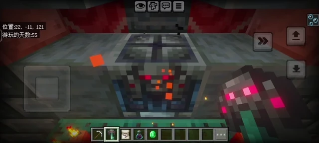

# Pickaxe Reset Vault 

[English](README.md) | 简体中文

一个用于 **Minecraft 基岩版** 的行为包，允许玩家用任意材质的镐子重置试炼宝库（Vault）。

## 功能 ✨
- 重置试炼宝库，以解除宝库一位玩家只能开启一次的限制。
- 兼容 1.20.60+ Script API

## 安装方法 📦
1. 前往 Releases 页面下载最新版本。
2. 导入行为包到 Minecraft 基岩版。
3. 在世界设置中启用该行为包。
4. 确保世界开启 Script API。

## 使用说明 🎮
将行为包启用并进入世界后，使用任意镐子右键（触屏模式为点击）宝库方块即可重置。

## 开源许可 📜
MIT License 

## 贡献代码 🤝
欢迎提交 Pull Request！